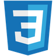

# Landing Page for Rooster Grin

This project is a simple landing page for Rooster Grin. It was designed using provided assets, including a mockup and images. It utilizes React as a frontend framework and Bootstrap as a CSS framework.

## Links

The live app is deployed on Render and can be visited [here](URL TBD).

## Technology

- Javascript, React, HTML, CSS, Bootstrap  
  

 
  

## Installation

1. Fork and clone this repository.
2. Run `npm install` to install project dependencies.
3. Run `npm start` to start the application locally.

## Preview

(screenshots placeholder)